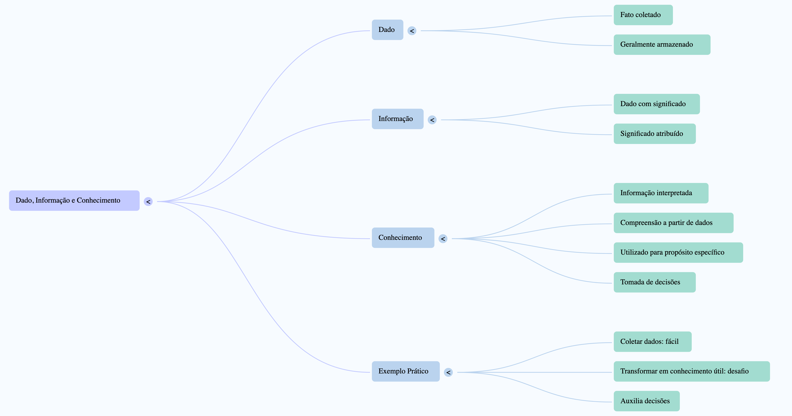

# Introdução à Ciência de Dados

## Fundamentos Iniciais

### Dado, Informação e Conhecimento

- **Dado:** É um fato coletado e geralmente armazenado.
- **Informação:** É um dado que possui algum significado atribuído.
- **Conhecimento:** É uma informação interpretada, compreendida a partir de dados, e utilizada para um propósito específico, como a tomada de decisões.

Exemplo prático: coletar dados é fácil, mas transformá-los em conhecimento útil que auxilia decisões é o verdadeiro desafio.

**Mapa Mental:**



## Mineração de Dados (MD)

Devido à abundância de dados disponíveis hoje, surgiu a necessidade de métodos sistemáticos para extrair conhecimento útil desses dados. Isso é chamado de **Mineração de Dados** (MD), que envolve descobrir padrões ou regras úteis dentro de grandes conjuntos de dados.

### Definição formal
Mineração de Dados é a descoberta automática de conhecimento a partir de grandes quantidades de dados, através de modelos, padrões ou regras.

## Aprendizado de Máquina (AM)

Aprendizado de Máquina é uma subárea da Inteligência Artificial onde sistemas aprendem automaticamente padrões ou comportamentos a partir de exemplos ou observações.

### Definição Formal (Mitchell)

> “Um programa aprende com a experiência E, para uma tarefa T e medida de desempenho P, se seu desempenho em T, medido por P, melhora com a experiência E.”

### Componentes do Aprendizado

- **Problema:** Exemplo - Análise de crédito
- **Entrada:** Dados do cliente (idade, renda, débito, etc.)
- **Saída:** Classificação (bom ou mau cliente)
- **Função Objetivo:** Ideal (desconhecida)
- **Dados históricos:** Exemplos usados para treinamento
- **Hipótese:** Função aprendida pelo modelo

**Mapa Mental:**

```
Aprendizado de Máquina
├─ Experiência (dados históricos)
├─ Tarefa (o que se quer prever)
├─ Desempenho (medição do acerto)
└─ Hipótese (modelo treinado)
```

## Principais Algoritmos

### Aprendizado Supervisionado
- **k-NN (k-Nearest Neighbors):** Classifica novos dados com base nos dados mais próximos já conhecidos. Exemplo: Classificar um filme com base em filmes semelhantes já avaliados.
- **Árvores de Decisão:** Utiliza perguntas sequenciais para dividir os dados em grupos menores, até alcançar uma classificação clara. Exemplo: Decidir se alguém é elegível para crédito bancário com base em renda e histórico financeiro.
- **Naive Bayes:** Classifica com base em probabilidades calculadas a partir de dados anteriores. Exemplo: Classificar um e-mail como spam analisando a frequência de palavras comuns em spams anteriores.
- **Perceptron/Adaline:** Algoritmos simples que aprendem padrões ajustando pesos em neurônios artificiais para classificar os dados. Exemplo: Determinar se uma transação bancária é fraudulenta ou não.
- **Redes Neurais (MLP - MultiLayer Perceptron):** Formadas por várias camadas de neurônios artificiais, são capazes de aprender padrões complexos, como reconhecimento facial ou de voz.

### Aprendizado Não-Supervisionado
- **k-means:** Agrupa dados semelhantes em clusters com base na distância entre eles. Exemplo: Agrupar clientes em perfis diferentes de consumo.
- **Métodos Hierárquicos:** Cria agrupamentos em níveis, formando uma estrutura de hierarquia. Exemplo: Classificar espécies biológicas.
- **Mapas Auto-organizáveis (SOM):** Técnica visual que organiza dados em grupos com base em suas semelhanças, útil para visualizar grandes volumes de dados e suas relações.

**Mapa Mental dos Algoritmos:**

```
Algoritmos
├─ Supervisionado
│  ├─ Classificação
│  │  ├─ k-NN
│  │  ├─ Árvores de Decisão
│  │  ├─ Naive Bayes
│  │  └─ MLP
│  └─ Regressão
│     ├─ k-NN
│     ├─ Árvores de Decisão
│     └─ MLP
└─ Não-Supervisionado
   ├─ k-means
   ├─ Hierárquicos
   └─ SOM
```

## Relação entre MD e AM

- **Mineração de Dados:** Extrai conhecimento automaticamente dos dados.
- **Aprendizado de Máquina:** Provê algoritmos para identificar padrões automaticamente.
- Ambas usam métodos estatísticos e podem se complementar.

## Ciência de Dados

Ciência de Dados é uma área interdisciplinar que estuda, utiliza e analisa dados ao longo de todo o seu ciclo de vida para produzir valor e apoiar decisões estratégicas.

### Principais etapas e atividades da Ciência de Dados:
- Coleta dos dados
- Preparação e tratamento dos dados (ETL - Extract, Transform, Load)
- Aplicação de algoritmos de aprendizado de máquina
- Mineração e interpretação dos resultados
- Visualização e comunicação dos insights gerados

**Mapa Mental:**

```
Ciência de Dados
├─ Coleta de Dados
├─ Engenharia de Dados (ETL)
├─ Aplicação de Algoritmos
├─ Mineração e Análise
└─ Visualização e Comunicação
```

## Papéis na Ciência de Dados:

- **Cientista de Dados:** Formula questões estratégicas, prepara dados e identifica insights.
- **Analista de Dados:** Cria relatórios e dashboards.
- **Engenheiro de Dados:** Desenvolve infraestrutura para armazenamento e processamento.
- **Arquiteto de Dados:** Define estruturas e políticas para dados.

## Interdisciplinaridade da Ciência de Dados:
Combina aprendizado de máquina, gerenciamento de dados, análise, estatística, computação distribuída, visualização de dados, programação e habilidades de comunicação.

## Análise Explícita vs. Implícita

- **Explícita:** Informação clara e simples de extrair.
- **Implícita:** Informação oculta, exigindo algoritmos sofisticados para sua descoberta.

## Análise Exploratória
Utiliza técnicas quantitativas e visuais para explorar dados e encontrar padrões.

## Business Intelligence (BI)
Ferramentas que realizam análises exploratórias, explícitas e implícitas para apoiar decisões empresariais.

